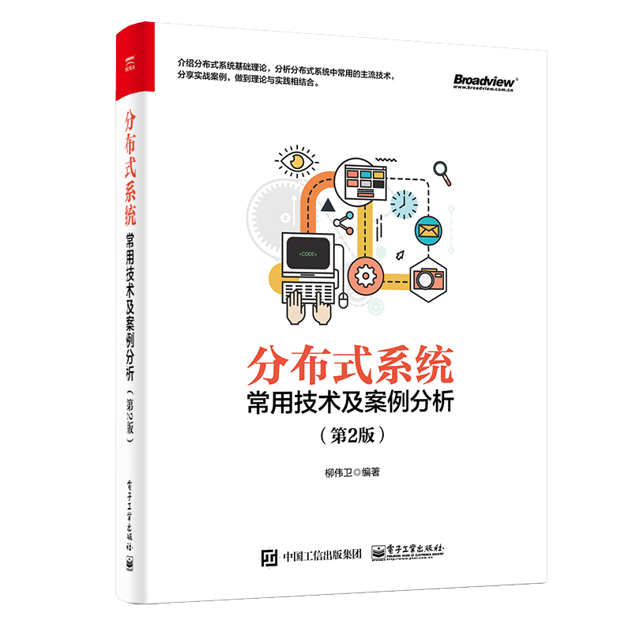

# 《分布式系统常用技术及案例分析（第2版）》

## 再版序

时光荏苒，岁月匆匆，距离《分布式系统常用技术及案例分析》2017年2月第1版已经一载有余。热心的读者对于本书也投以了极大的关注，伴随着本书的成长，提了很多中肯的建议。对于这些意见，不管褒贬，一并全收，于是才有了第2版的可能。
对于技术型的书籍创作，笔者更加倾向于采用当今软件开发主流的方式——敏捷。敏捷写作打通了编写、校稿、出版、发行的整个流程，让知识可以第一时间呈现给读者。读者在阅读本书之后，也可以及时对书中的内容进行反馈，从而帮助作者完善书中内容，最终形成了良好的反馈闭环。所以，第2版所更新的内容，应该正是读者所期待的。

第2版修改篇幅较大，其余章节都做了大幅度更新。整改内容大致分为以下几个方面：

1. 删除安装介绍等比较简单的内容。
2. 每个章节开头，新增“概述”让各个章节的技术点可以关联起来。
3. 每个章节增加“实战”案例，让技术点更具有可操作性。
4. 修改原文中措辞、插图。
5. 删除第9-10章。

完整的修改内容，可以参阅本书后面部分“附录A：本书1版与2版的差异对比”章节内容。

## 本书与开源的关系

本书所列之技术多为开源技术，本书所撰写的大部分内容也多取材自我个人的博客以及个人编写的开源书（也算是为开源事业贡献微薄之力吧），符合“取自开源，回馈开源”之宗旨。不想看本书的也可以直接关注我博客（<https://waylau.com>）或者开源书（<https://waylau.com/books>）的内容。当然，博客相对来说比较零散，没有这本书来的严谨。

## 内容介绍

本书分为两大部分，即分布式系统基础理论及分布式系统常用技术。第一部分为第1章和第2章，主要介绍分布式系统基础理论知识，总结一些在设计分布式系统时需要考虑的范式、知识点以及可能会面临的问题。 第二部分为第3章到第8章，主要列举了在分布式系统应用中经常用到的一些主流技术，并介绍这些技术的作用和用法。

* 第1章介绍分布式系统基础理论知识，总结一些在设计分布式系统时需要考虑的范式、知识点以及可能会面临的问题，其中包括线程、通信、一致性、容错性、CAP理论、安全性和并发等相关内容。
* 第2章详细介绍分布式系统的架构体系，包括传统的基于对象的体系结构、SOA，也包括最近比较火的RESTful风格架构、微服务、容器技术、Serverless架构等。
* 第3章介绍常用的分布式消息服务框架，包括Apache ActiveMQ、RabbitMQ、RocketMQ、Apache Kafka等。
* 第4章介绍分布式计算理论和应用框架方面的内容，包括MapReduce、Apache Hadoop、Apache Spark、Apache Mesos 等。
* 第5章介绍分布式存储理论和应用框架方面的内容，包括Bigtable、Apache HBase、Apache Cassandra、Memcached、Redis、MongoDB等。
* 第6章介绍分布式监控方面常用的技术，包括Nagios、Zabbix、Consul、ZooKeeper等。
* 第7章介绍常用的分布式版本控制工具，包括Bazaar、Mercurial、Git等。
* 第8章介绍RESTful API、微服务及容器相关的技术，着重介绍Jersey、Spring Boot、Docker等技术的应用。

您可以查看详细的书籍[目录](SUMMARY.md)。

本书涉及面相当之广，可以说涵盖了在设计分布式系统时，所要考虑的大部分问题及解决方案。

## 源代码

本书提供源代码下载，地址位于[本项目](https://github.com/waylau/distributed-systems-technologies-and-cases-analysis)下的`samples`目录。

## 分支说明

<https://github.com/waylau/distributed-systems-technologies-and-cases-analysis/tree/1.0.x> 这个分支，是2017年2月第1版
<https://github.com/waylau/distributed-systems-technologies-and-cases-analysis/tree/2.0.x> 这个分支，是2018年12月第2版

## 勘误和交流

本书如有勘误，会在<https://github.com/waylau/distributed-systems-technologies-and-cases-analysis/issues>上进行发布。由于笔者能力有限，时间仓促，难免错漏，欢迎读者批评指正。

读者也可以到博文视点官网的本书页面进行交流（<http://www.broadview.com.cn/30771>）。

您也可以上[豆瓣](https://book.douban.com/subject/26975204/)进行评论。

## 联系作者

您也可以直接联系我：

* 博客：https://waylau.com
* 邮箱：[waylau521(at)gmail.com](mailto:waylau521@gmail.com)
* 微博：http://weibo.com/waylau521
* 开源：https://github.com/waylau

## 如何获取本书

实体店及部分网店有售，据我所知有如下网站供应：

* [京东](https://search.jd.com/Search?keyword=%E6%9F%B3%E4%BC%9F%E5%8D%AB%20%E5%88%86%E5%B8%83%E5%BC%8F%E7%B3%BB%E7%BB%9F%E5%B8%B8%E7%94%A8%E6%8A%80%E6%9C%AF%E5%8F%8A%E6%A1%88%E4%BE%8B%E5%88%86%E6%9E%90%EF%BC%88%E7%AC%AC2%E7%89%88%EF%BC%89&enc=utf-8&wq=%E6%9F%B3%E4%BC%9F%E5%8D%AB%20%E5%88%86%E5%B8%83%E5%BC%8F%E7%B3%BB%E7%BB%9F%E5%B8%B8%E7%94%A8%E6%8A%80%E6%9C%AF%E5%8F%8A%E6%A1%88%E4%BE%8B%E5%88%86%E6%9E%90%EF%BC%88%E7%AC%AC2%E7%89%88%EF%BC%89&pvid=29e3bd72b6064ff796818f3914d82ca5)
* [当当](http://search.dangdang.com/?key=%C1%F8%CE%B0%CE%C0%20%B7%D6%B2%BC%CA%BD%CF%B5%CD%B3%B3%A3%D3%C3%BC%BC%CA%F5%BC%B0%B0%B8%C0%FD%B7%D6%CE%F6%A3%A8%B5%DA2%B0%E6%A3%A9&act=input)
* [淘宝](https://s.taobao.com/search?q=%E6%9F%B3%E4%BC%9F%E5%8D%AB+%E5%88%86%E5%B8%83%E5%BC%8F%E7%B3%BB%E7%BB%9F%E5%B8%B8%E7%94%A8%E6%8A%80%E6%9C%AF%E5%8F%8A%E6%A1%88%E4%BE%8B%E5%88%86%E6%9E%90%EF%BC%88%E7%AC%AC2%E7%89%88%EF%BC%89&imgfile=&commend=all&ssid=s5-e&search_type=item&sourceId=tb.index&spm=a21bo.2017.201856-taobao-item.1&ie=utf8&initiative_id=tbindexz_20170306)
* [china-pub](http://search.china-pub.com/s/?key1=%c1%f8%ce%b0%ce%c0+%b7%d6%b2%bc%ca%bd%cf%b5%cd%b3%b3%a3%d3%c3%bc%bc%ca%f5%bc%b0%b0%b8%c0%fd%b7%d6%ce%f6%a3%a8%b5%da2%b0%e6%a3%a9&type=&pz=1)
* [亚马逊](https://www.amazon.cn/s/ref=nb_sb_noss?__mk_zh_CN=%E4%BA%9A%E9%A9%AC%E9%80%8A%E7%BD%91%E7%AB%99&url=search-alias%3Daps&field-keywords=%E6%9F%B3%E4%BC%9F%E5%8D%AB+%E5%88%86%E5%B8%83%E5%BC%8F%E7%B3%BB%E7%BB%9F%E5%B8%B8%E7%94%A8%E6%8A%80%E6%9C%AF%E5%8F%8A%E6%A1%88%E4%BE%8B%E5%88%86%E6%9E%90%EF%BC%88%E7%AC%AC2%E7%89%88%EF%BC%89C)

也可以直接关注我博客（<https://waylau.com>）或者我的开源书（<https://waylau.com/books>）。

## 其他书籍

若您对本书不感冒，笔者还写了其他方面的超过一打的书籍（可见<https://waylau.com/books/>），多是开源电子书。

本人也维护了一个[books-collection](https://github.com/waylau/books-collection)项目，里面提供了优质的专门给程序员的开源、免费图书集合。

## 开源捐赠

捐赠所得所有款项将用于开源事业！
